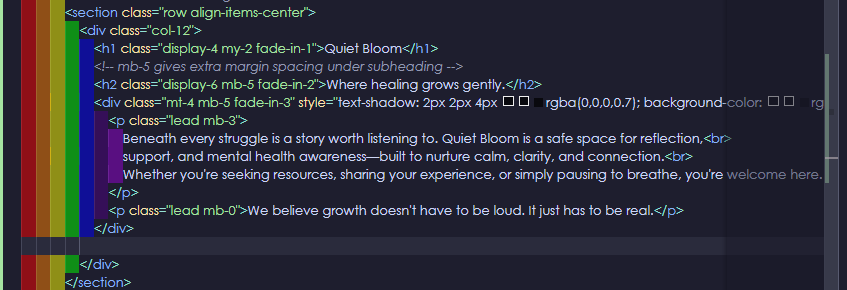
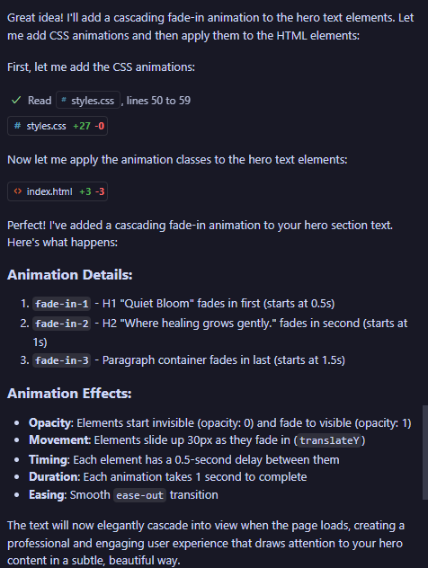
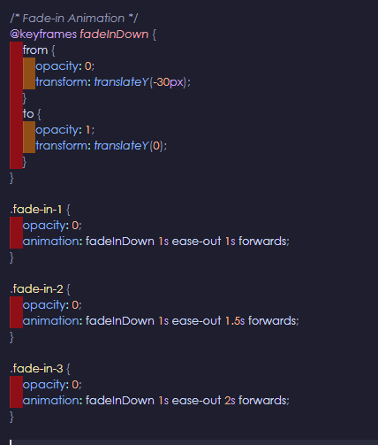
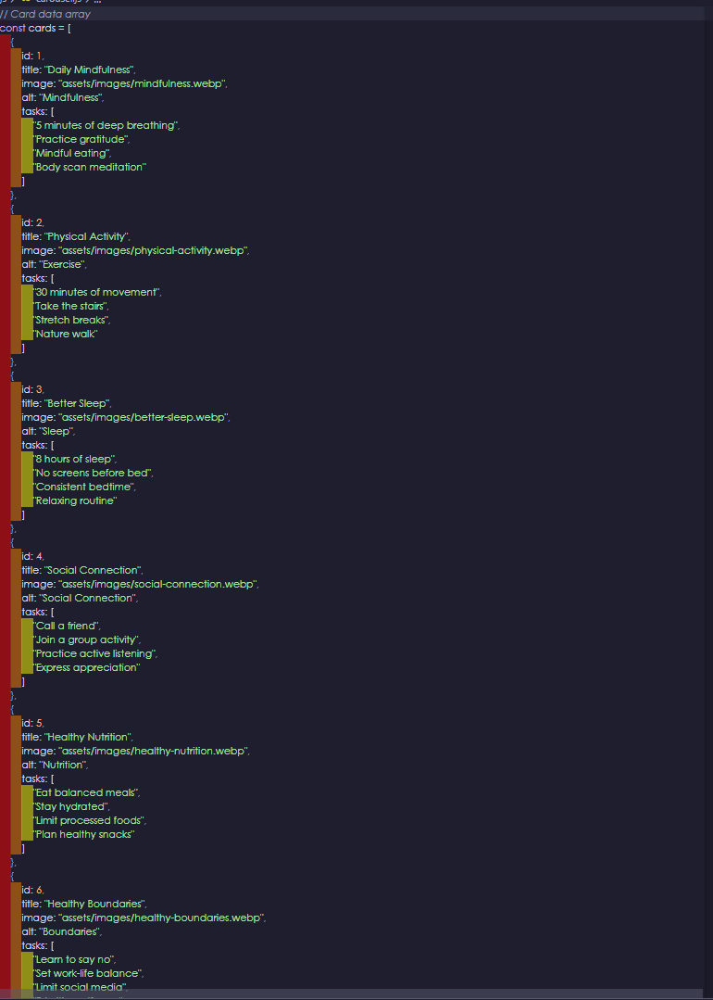
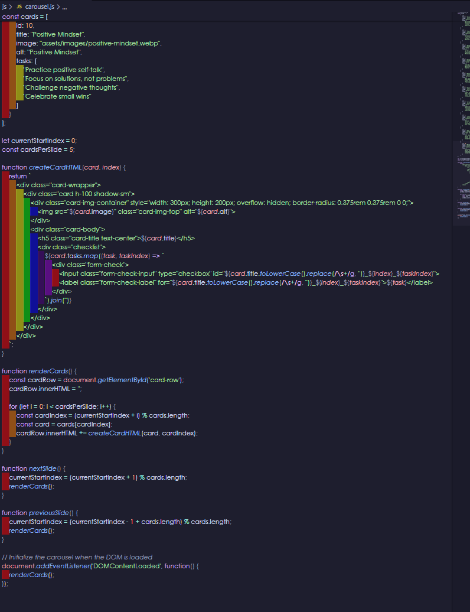
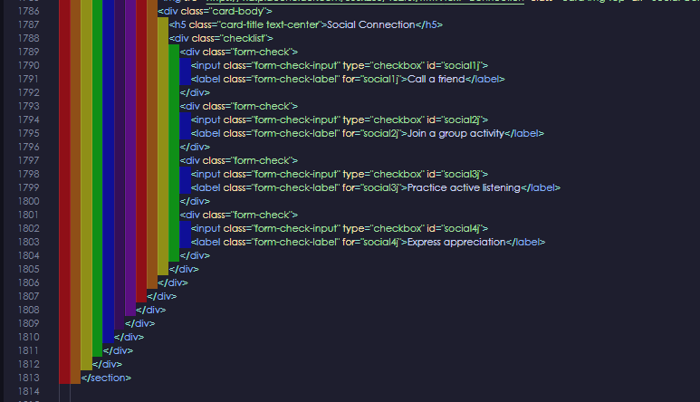
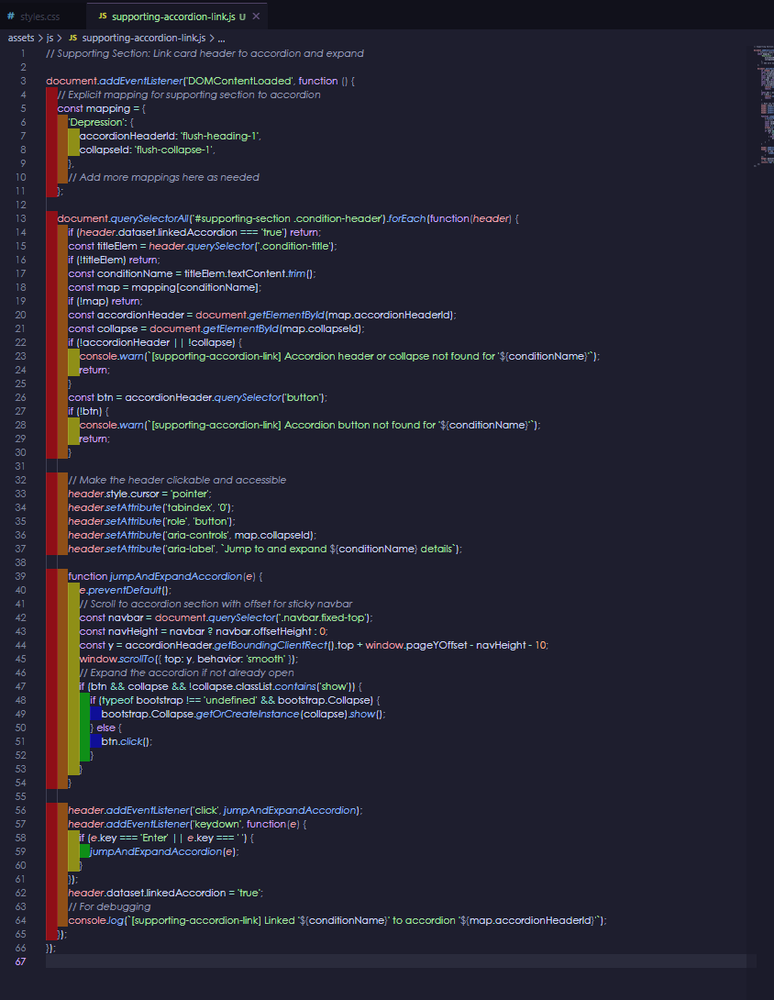
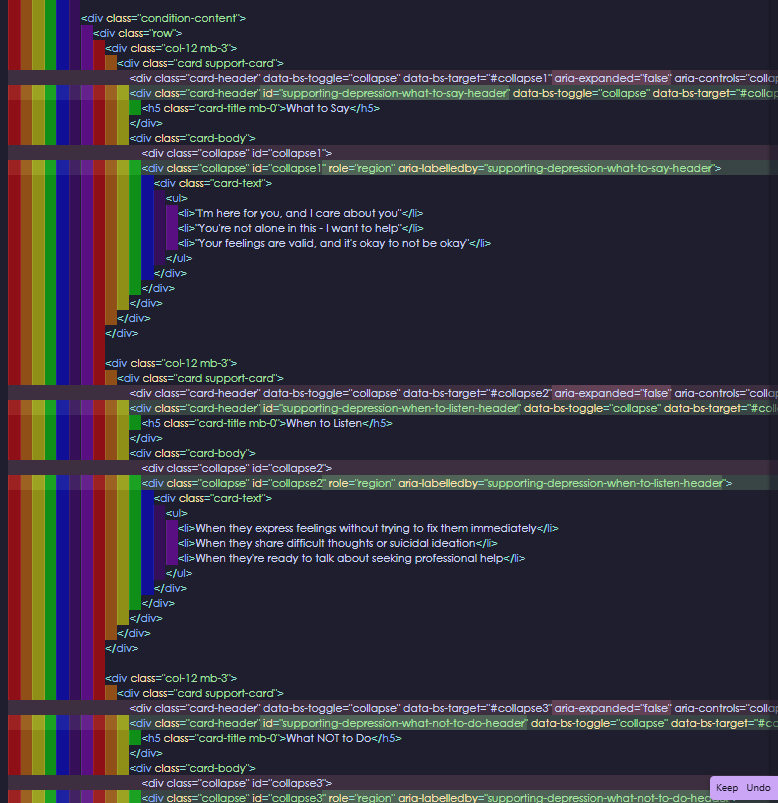
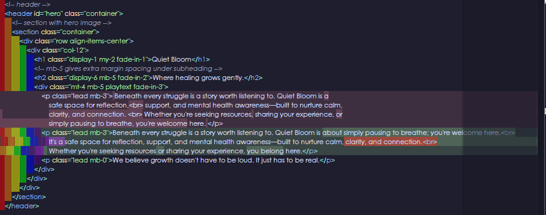

<h1 style="text-align: center; margin-top: 40px; padding-bottom: 40px; font-size: 40px;">🚀 Mental Health Awareness Website</h1>

> Everything you need to create a reliable, scalable single-page web application.  
> A simple, supportive space to raise awareness about mental health through open-source collaboration.  

<p align="center">
  <a href="https://rebeljoka.github.io/mental-health-awareness/index.html" target="_blank">
    
    <br>
    <span style="font-size: 1.2em; font-weight: bold; color: #6a7f8c;">Visit Quiet Bloom</span>
  </a>
</p>

<p align="center">Frameworks and Languages Used For This Project:</p>
<div align="center" style="margin-top: 40px; padding-bottom: 40px;">
  <code></code>
  <code></code>
  <code></code>
  <code></code>
  <code></code>
  <code></code>
  <code></code>
  <code></code>
</div>

---

<h2 align="center" style="font-size: 33px; padding-bottom:30px;">🌸 Introduction</h2>

> “Mental health is not a destination, but a process. It's about how you drive, not where you're going.”  
> — Noam Shpancer

Welcome to **Mental Health Awareness**, an open-source initiative rooted in empathy, understanding, and emotional resilience.

This project is part of the Quiet Bloom ethos — nurturing supportive spaces where calm design meets meaningful dialogue. Together, we're creating a platform that feels:

- 🌼 **Gentle** — soft tones, clear layouts, and accessible language
- 🤝 **Inclusive** — inviting everyone to contribute, learn, and grow
- 📘 **Resourceful** — offering tools and conversations that empower

Whether you're a developer, designer, or simply someone who cares, your presence matters. Let’s build something that whispers reassurance and stands firm in support.

---

<h2 align="center" style="font-size: 33px; padding-bottom: 30px;">🌼 Features</h2>

Quiet Bloom’s Mental Health Awareness project offers tools and spaces designed to be as reassuring as they are informative — grounded in accessibility, emotional clarity, and gentle design.

- 🪴 **Emotive Content**  
  Thoughtfully curated insights and affirmations that validate lived experiences and foster deeper understanding.

- 🎐 **Accessible Resources**  
  Designed with clear typography and calm visual language — approachable for all, including those navigating cognitive overwhelm.

- 💬 **Open Conversation**  
  Structures and formats that invite vulnerability, community feedback, and peer-to-peer support in a judgment-free space.

- 🛠️ **Creative Contributions**  
  Welcoming developers, designers, and thinkers to co-create gentle tools — from affirmations to calming interfaces.

- 🌥️ **Quiet Advocacy**  
  A non-disruptive approach to raising awareness, rooted in softness, subtlety, and mindful digital presence.

### 1. Responsive Header with WCAG support against color contrasts

**Welcoming introduction, calming visuals, and clear site purpose.**


### 2. Mental Health Accordion

**Accessible, collapsible panels for key mental health conditions with concise explanations.**


### 3. Quick Tips Carousel

**Interactive carousel with daily wellness checklists and touch-friendly controls.**


### 4. Supporting Someone Section

**Actionable advice for helping others, with expandable cards and clear ARIA accessibility.**


### 5. Modern Footer

**High-contrast, accessible footer with legal links, social icons, and location branding.**


---

<h2 align="center" style="font-size: 33px; padding-bottom: 30px;">☁️ Deployment & Project Overview</h2>

<h3 style="font-size:26px;">Purpose</h3>

Quiet Bloom is a modern, accessible single-page web application dedicated to promoting mental health awareness, support, and actionable resources. The site is designed to provide a safe, welcoming space for users to learn, reflect, and find practical guidance for themselves or others.

<h3 style="font-size:26px;">User Value</h3>

- **Accessible, Responsive Design:** Works seamlessly on all devices and for all users, including those using assistive technologies.

- **Evidence-Based Content:** Actionable tips, checklists, and support strategies for common mental health conditions.

- **Smooth Navigation:** Sticky navbar, anchor offset, and robust mobile experience.

- **Support for Others:** Dedicated section for helping friends, family, or colleagues.

<h3 style="font-size:26px;">Initial Design Phase</h3>

**Initial Website Design Planned on Wireframes**


<div align="center">

| **First Color Palette Option** | **Second Color Palette Option** | **Final Color Palette Option** |
|:------------------------------------:|:------------------------------------------:|:---------------------------:|
|  |  |  |

</div>

**User Stories**


<div align="center">
<table style="font-size:10px; text-align:center; width:100%; border:2px solid #fff; border-collapse:collapse; border-radius:25%;">
  <tr>
    <th></th>
    <th>Mobile First UX</th>
    <th>First-Time Visitor</th>
    <th>Curious Learner</th>
    <th>Stressed Individual</th>
    <th>Caring Individual</th>
    <th>Privacy-Conscious Visitor</th>
    <th>Reassured Visitor</th>
  </tr>
  <tr>
    <th style="text-align:center;">User Story</th>
    <td>AS A mobile user, I WANT TO browse easily on my phone, SO THAT I CAN access support anytime, anywhere.</td>
    <td>AS A first-time visitor, I WANT TO feel welcome and reassured by the site’s calm design, SO THAT I CAN explore sensitive topics safely.</td>
    <td>AS A curious learner, I WANT TO access simple explanations of common mental health challenges, SO THAT I CAN understand symptoms without being overwhelmed.</td>
    <td>AS A stressed individual, I WANT TO read calming advice and practical stress relief tips, SO THAT I CAN manage my emotions with confidence.</td>
    <td>AS A caring individual, I WANT TO learn supportive ways to help someone feeling stressed or low, SO THAT I CAN offer kind and effective encouragement.</td>
    <td>AS A privacy-conscious visitor, I WANT TO explore mental health resources without judgment or data tracking, SO THAT I CAN feel safe and supported.</td>
    <td>As a cautious visitor, I want to see clear, professional design and trust signals, so I feel safe browsing and engaging with the site.</td>
  </tr>
  <tr>
    <th style="text-align:center;">Features</th>
    <td style="text-align:left;">✅ Mobile-first layout (Bootstrap grid)<br>✅ Collapsible navbar<br>✅ Large touch targets<br>✅ Tested across Chrome/Firefox</td>
    <td style="text-align:left;">✅ Calming hero section<br>✅ Welcoming tagline/subheading<br>✅ Gentle fade-in animation<br>✅ Supportive navbar with icons</td>
    <td style="text-align:left;">✅ Accordion for key topics<br>✅ Friendly icons<br>✅ Accessible font sizes<br>✅ Anchor links</td>
    <td style="text-align:left;">✅ “Quick Tips for Stress” cards<br>✅ Calming thumbnails<br>✅ Optional checklists<br>✅ External resource links</td>
    <td style="text-align:left;">✅ Supportive section with panels<br>✅ Gentle bullet-point tips<br>✅ Panels for Listen/Say/Avoid</td>
    <td style="text-align:left;">✅ Soft confidential language</td>
    <td style="text-align:left;">✅ Link to Terms/Legal<br>✅ Human touch text<br>✅ Language toggle/region selector</td>
  </tr>
  <tr>
    <th style="text-align:center;">Acceptance Criteria</th>
    <td style="text-align:left;">✅ Content stacks &lt;576px<br>✅ Navbar toggles smoothly<br>✅ Elements finger-friendly<br>✅ No horizontal scroll</td>
    <td style="text-align:left;">✅ Hero section looks welcoming<br>✅ Pastel color palette<br>✅ Navigation is clear + accessible<br>✅ Transitions are smooth</td>
    <td style="text-align:left;">✅ Accordion opens 3+ topics in 2 clicks<br>✅ WCAG AA fonts/contrast<br>✅ Headings + &lt;150 word paragraphs</td>
    <td style="text-align:left;">✅ Vertical stacking on mobile<br>✅ Each card includes heading + image<br>✅ Checklist toggles visually<br>✅ External links open in tabs with labels</td>
    <td style="text-align:left;">✅ Mobile + desktop support<br>✅ 3+ plain text tips per panel<br>✅ Supportive non-diagnostic tone</td>
    <td style="text-align:left;">✅ Navigation/resources don’t depend on identity/session</td>
    <td style="text-align:left;">✅ Footer with privacy, contact, social links<br>✅ Professional layout<br>✅ Clean visuals + subtle animations<br>✅ Optimized for mobile and desktop</td>
  </tr>
</table>
</div>

<h3 style="font-size:26px;">Deployment</h3>

1. **Clone the repository:**

   ```sh
   git clone https://github.com/Rebeljoka/mental-health-awareness.git
   ```

2. **Navigate to the project folder:**

   ```sh
   cd mental-health-awareness
   ```

3. **Open `index.html` in your browser** or deploy to a static hosting platform (e.g., GitHub Pages, Netlify, Vercel).
4. **No build step required** – all assets are ready to use.

---

<h2 align="center" style="font-size: 33px; padding-bottom:30px;">🤝 Contributing</h2>

We believe that gentle design and thoughtful collaboration can make a real difference.

Whether you're a developer, designer, writer, or someone with lived experience — your voice matters. Contributions can be technical, creative, or emotional. Every addition helps nurture a space where mental health is met with empathy and clarity.

<h3 style="font-size:26px;">Ways to Contribute</h3>

- 🧠 Share ideas for new features or calming tools
- 🎨 Refine design elements to enhance accessibility and emotional tone
- 📝 Improve documentation or add affirming content
- 🐛 Report bugs or suggest gentle improvements

<h3 style="font-size:26px;">Getting Started</h3>

1. Fork the repository
2. Create your feature branch (`git checkout -b feature/YourIdea`)
3. Commit your changes (`git commit -m 'Add something meaningful'`)
4. Push to the branch (`git push origin feature/YourIdea`)
5. Open a pull request with a kind note

> Contributions are welcomed with gratitude and reviewed with care. There’s no rush — just rhythm.

---

<h2 align="center" style="font-size: 33px; padding-bottom:30px;"> ⊹ ࣪ ﹏𓊝﹏𓂁﹏⊹ ࣪ ˖ Lighthouse Results</h2>

<div align="center">

| **Desktop Lighhouse Results** | **Mobile Lighthouse Results** |
|:---------------------------:|:-------------------------:|
|  |  |

</div>

---

<h2 align="center" style="font-size: 33px; padding-bottom:30px;">👨‍💻 Code Validation Results</h2>

- **HTML Results**


- **CSS Results**


---

<h2 align="center" style="font-size: 33px; padding-bottom:30px;">📚 Attribution & Accreditation</h2>

- **Favicons:** Generated with GitHub Copilot using the prompt "generate a favicon for a mental health website called Quiet Bloom".

<div align="center">
  
</div>

- **Hero Image:** Sourced from [altphotos.com](https://altphotos.com/photo/long-exposure-mysterious-pink-sea-209/)


- **Color Palette Research:**
  - [Color Hunt Pastel Palettes](https://colorhunt.co/palettes/pastel)
  - [Paper Heart Design - Peaceful Palettes](https://paperheartdesign.com/blog/color-palette-peaceful-palettes)

- **Fonts:** Google Fonts (Oooh Baby, Poiret One)
  - [Oooh Baby, Poiret One](https://fonts.googleapis.com/css2?family=Oooh+Baby&family=Poiret+One&display=swap)

- **Accessibility:**
  - [WCAG AA Contrast Checker](https://webaim.org/resources/contrastchecker/?fcolor=000000&bcolor=2E819D)

- **Card Image Content:**
  - Daily Mindfulness: [Unsplash Illustration](https://unsplash.com/illustrations/two-women-meditate-in-the-butterfly-pose-TRI4BogkWU4)
  - Physical Activity: [Unsplash Illustration](https://unsplash.com/illustrations/a-person-riding-a-skateboard-next-to-a-pair-of-sneakers-7EZ_k5e5CSk)
  - Better Sleep: [Unsplash Illustration](https://unsplash.com/illustrations/a-woman-looks-at-the-moon-in-the-night-sky-OuOfMgd9ueY)
  - Social Connection: [Unsplash Illustration](https://unsplash.com/illustrations/a-group-of-people-standing-around-a-woman-in-a-wheelchair-pquE90oyRjU)
  - Healthy Nutrition: [Unsplash Illustration](https://unsplash.com/illustrations/a-picture-of-a-bunch-of-fruit-on-a-table-MKOx7RqWEFo)
  - Healthy Boundaries: [Unsplash Illustration](https://unsplash.com/illustrations/couple-enjoys-sunset-view-from-the-cliffs-xGtLm5hw6wI)
  - Stress Management: [Unsplash Illustration](https://unsplash.com/illustrations/a-person-sits-alone-appearing-sad-and-isolated-B1x3KYNgae0)
  - Creative Expression: [Unsplash Illustration](https://unsplash.com/illustrations/an-abstract-painting-of-a-woman-with-a-hat-Kiln3TxKAfI)
  - Goal Setting: [Unsplash Illustration](https://unsplash.com/illustrations/a-surfer-walks-towards-the-beach-houses-HFhljcnPMts)
  - Positive Mindset: [Unsplash Illustration](https://unsplash.com/illustrations/a-boy-runs-towards-the-sun-on-a-sunny-day-5MAkU4sRAac)

- **Accordion Design Inspiration:** [Bootdey - Bootstrap Accordion Start Templates](https://www.bootdey.com/snippets/view/Bootstrap-accordion-Start-Templates)

- **Card Carousel Inspiration:** [GoSnippets - Bootstrap Carousel with Cards in 3 Columns](https://gosnippets.com/snippets/bootstrap-carousel-with-cards-in-3-columns)

- **JavaScript Assistance:** GitHub Copilot

- **Icons:** [Font Awesome](https://fontawesome.com/) (MIT License)
- **Images:** All images are original, royalty-free, or used with permission.
- **Framework:** [Bootstrap 5](https://getbootstrap.com/) (MIT License)
- **Code:** All code is original or generated with the assistance of GitHub Copilot. No third-party code is used without attribution.

---

<h2 align="center" style="font-size: 33px; padding-bottom:30px;">🤖🧑🏽‍💻 Use Of AI</h2>

<div align="center">
  
  <p><em>AI Generated Text</em></p>

  
  
  <p><em>AI Generated Animation For Header</em></p>

  
  
  <p><em>AI Generated JavaScript Code for Card Carousel</em></p>

  
  <p><em>AI Generated Checklist Within Quick Tips Carousel</em></p>

  
  <p><em>AI Generated Anchor Links + JavaScript for Supporting Section</em></p>

  
  <p><em>AI Generated Aria Attributes to Supporting Section</em></p>

  
  <p><em>AI Generated Bug Scanning, Broken Links, Unused CSS, Grammatical Errors</em></p>
</div>

---

<h2 align="center" style="font-size: 33px; padding-bottom:30px;">🤖 AI-Assisted Development Reflection</h2>

GitHub Copilot and generative AI tools played a key role in the development of Quiet Bloom. AI was used to generate accessible HTML, CSS, and JavaScript components, suggest performance and UX improvements, and identify and resolve bugs throughout the build. This accelerated the workflow, allowing more time to focus on user experience, accessibility, and content quality. All AI-generated code and suggestions were carefully reviewed and adapted to fit the project’s unique requirements, ensuring a professional and maintainable result. Leaving me plenty of time to edit this readme, collect and organise my documentation and complete the wireframe for the site.

For more details, see the full documentation and code comments.

<p align="center">
  <a href="https://rebeljoka.github.io/mental-health-awareness/index.html" target="_blank">
    
    <br>
    <span style="font-size: 1.2em; font-weight: bold; color: #6a7f8c;">Visit Quiet Bloom</span>
  </a>
</p>
