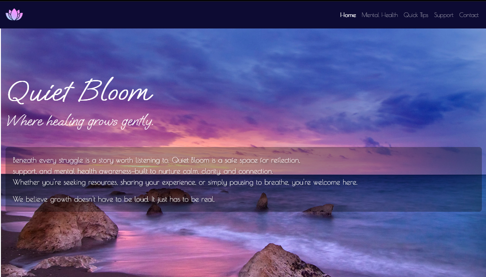
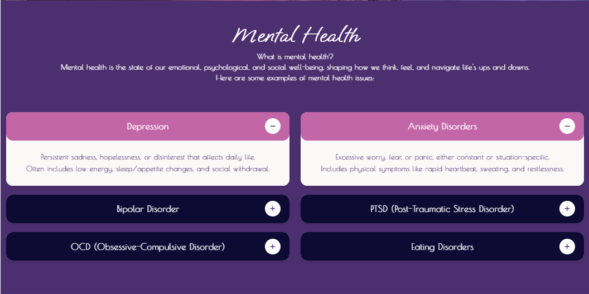
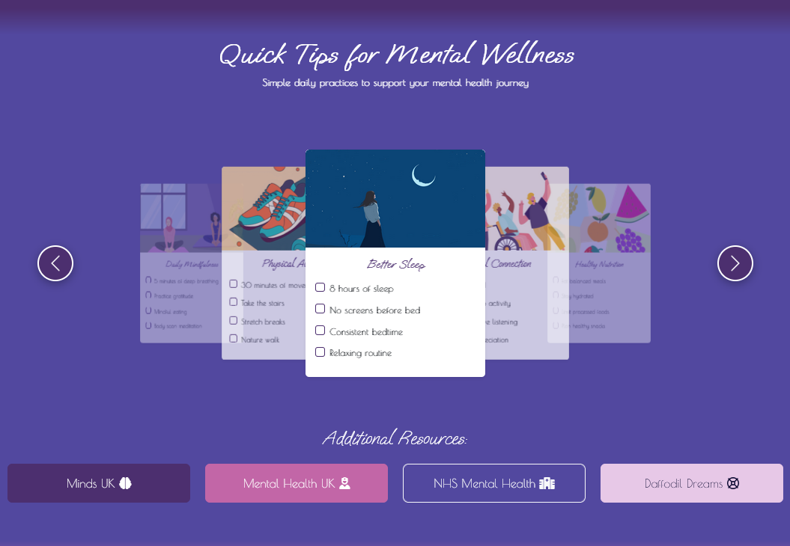
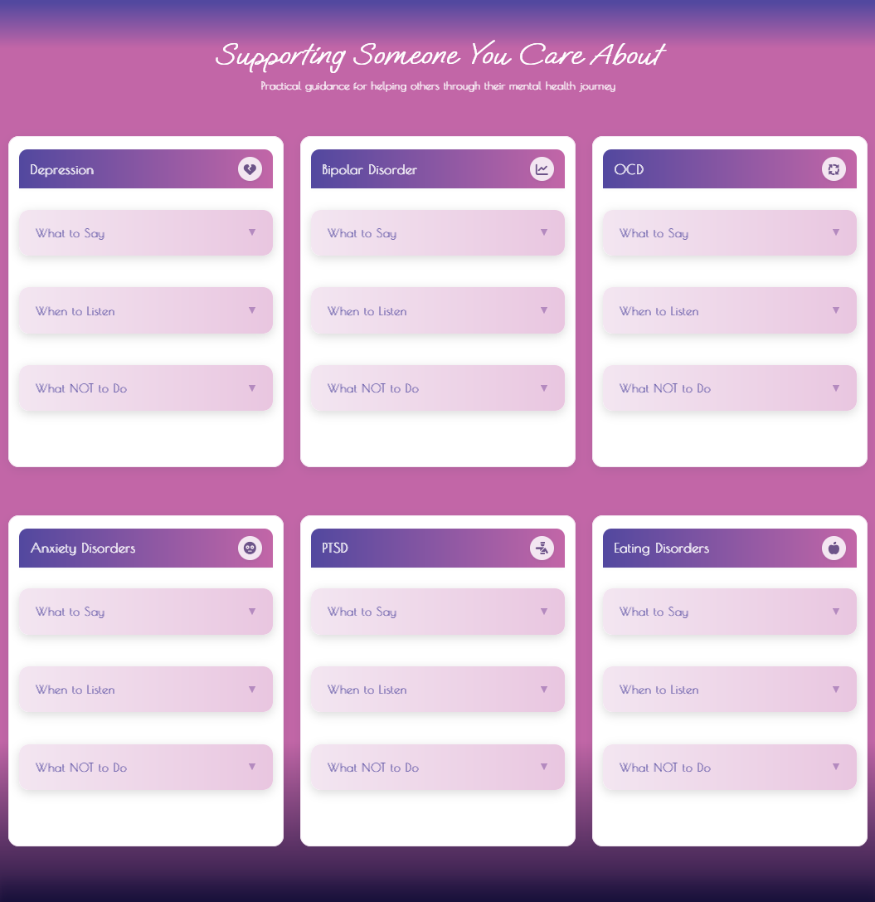

# 🚀 Mental Health Awareness Website - Checklist

> Build. Test. Ship. Improve.  
> Everything you need to create a reliable, scalable single-page web application.

<div align="center">
	<code></code>
	<code></code>
	<code></code>
	<code></code>
	<code></code>
	<code></code>
	<code></code>
	<code></code>
</div>

---

## ☁️ Deployment & Project Overview

### Purpose
Quiet Bloom is a modern, accessible single-page web application dedicated to promoting mental health awareness, support, and actionable resources. The site is designed to provide a safe, welcoming space for users to learn, reflect, and find practical guidance for themselves or others.

### User Value
- **Accessible, Responsive Design:** Works seamlessly on all devices and for all users, including those using assistive technologies.
- **Evidence-Based Content:** Actionable tips, checklists, and support strategies for common mental health conditions.
- **Smooth Navigation:** Sticky navbar, anchor offset, and robust mobile experience.
- **Support for Others:** Dedicated section for helping friends, family, or colleagues.

---

## � Deployment Steps

1. **Clone the repository:**
   ```sh
   git clone https://github.com/Rebeljoka/mental-health-awareness.git
   ```
2. **Navigate to the project folder:**
   ```sh
   cd mental-health-awareness
   ```
3. **Open `index.html` in your browser** or deploy to a static hosting platform (e.g., GitHub Pages, Netlify, Vercel).
4. **No build step required** – all assets are ready to use.

---

## ✨ Features & Screenshots

### 1. Hero Section

*Welcoming introduction, calming visuals, and clear site purpose.*

### 2. Mental Health Accordion

*Accessible, collapsible panels for key mental health conditions with concise explanations.*

### 3. Quick Tips Carousel

*Interactive carousel with daily wellness checklists and touch-friendly controls.*

### 4. Supporting Someone Section

*Actionable advice for helping others, with expandable cards and clear ARIA accessibility.*

### 5. Modern Footer

*High-contrast, accessible footer with legal links, social icons, and location branding.*

---

## 📚 Attribution

- **Icons:** [Font Awesome](https://fontawesome.com/) (MIT License)
- **Images:** All images are original, royalty-free, or used with permission.
- **Framework:** [Bootstrap 5](https://getbootstrap.com/) (MIT License)
- **Code:** All code is original or generated with the assistance of GitHub Copilot. No third-party code is used without attribution.

---

For more details, see the full documentation and code comments.
